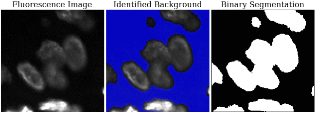

# Local Mean Suppression Filter (LMSF) for Effective Background Identification in Fluorescence and Grayscale Images

This is an implementation of [LMSF](https://doi.org/10.1101/2024.09.25.614955) on Python 3 with using NumPy. LMSF is easy-to-use, nonlinear filter for effective background identification in fluorescence microscopy and other grayscale images with dense and low-contrast foreground objects.


The repository includes:
* Source Python code of LMSF (lmsf.py).
* Jupyter notebook (run_lmsf.ipynb) and Python script (run_lmsf.py) demonstrate the application of LMSF to a digital signal as well as to a fragment of fluorescence image.
* Test fragment of one-channel fluorescence image (image_fragment.tif).
* Requirements.txt

## Installation
Before running LMSF, make sure you have this or a newer version of NumPy installed.
```
numpy==1.24.3
```

## Usage
The Jupyter notebook (run_lmsf.ipynb) contains two examples that give a gentle introduction to using of LMSF. The first example demonstrates the use of LMSF to denoise digital signal samples, and the second illustrates LMSF background denoising of a grayscale image.
Before running the Jupyter notebook, make sure that you place the Jupyter notebook, the source file, and the test image in the same directory.

### LMSF for a Digital Signal
To denoise equidistant signal samples, import `lmsf_1d`
```
from lmsf import lmsf_1d
```

### LMSF for a Grayscale Image
To denoise a grayscale digital image, import `lmsf_2d` and `lmsf_2d_cumulative`
```
from lmsf import lmsf_2d, lmsf_2d_cumulative
```


## Citing LMSF
If you find UNSEG useful in your research, please consider citing:

```
@article {Kochetov2024.09.25.614955,
	author = {Kochetov, Bogdan and Uttam, Shikhar},
	title = {Local Mean Suppression Filter for Effective Background Identification in Fluorescence Images},
	elocation-id = {2024.09.25.614955},
	year = {2024},
	doi = {10.1101/2024.09.25.614955},
	publisher = {Cold Spring Harbor Laboratory},
	abstract = {We present an easy-to-use, nonlinear filter for effective background identification in fluorescence microscopy images with dense and low-contrast foreground. The pixel-wise filtering is based on comparison of the pixel intensity with the mean intensity of pixels in its local neighborhood. The pixel is given a background or foreground label depending on whether its intensity is less than or greater than the mean respectively. Multiple labels are generated for the same pixel by computing mean expression values by varying neighborhood size. These labels are accumulated to decide the final pixel label. We demonstrate that the performance of our filter favorably compares with state-of-the-art image processing, machine learning, and deep learning methods. We present three use cases that demonstrate its effectiveness, and also show how it can be used in multiplexed fluorescence imaging contexts and as a denoising step in image segmentation. A fast implementation of the filter is available in Python 3 on GitHub.Competing Interest StatementThe authors have declared no competing interest.},
	URL = {https://www.biorxiv.org/content/early/2024/09/26/2024.09.25.614955},
	eprint = {https://www.biorxiv.org/content/early/2024/09/26/2024.09.25.614955.full.pdf},
	journal = {bioRxiv}
}
```
## QR code

