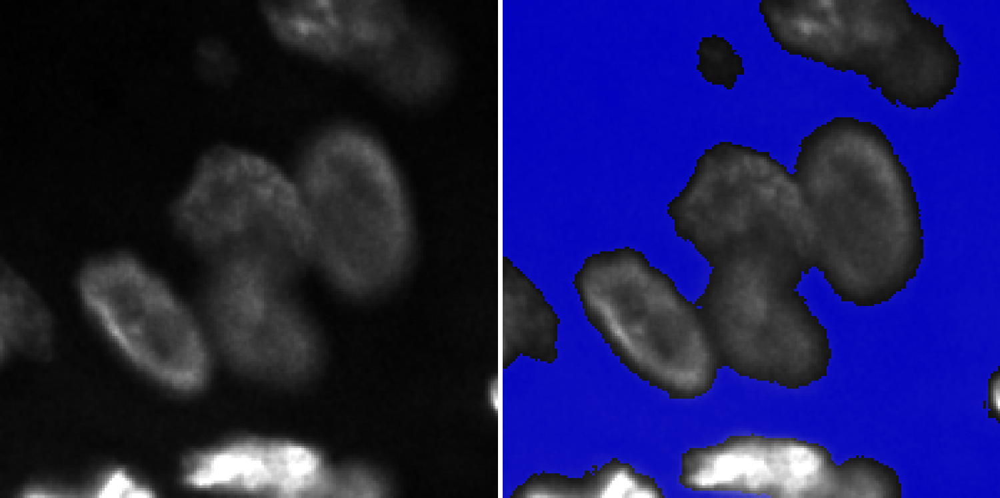

# Local Mean Suppression Filter (LMSF) for Effective Background Identification in Fluorescence and Grayscale Images

This is an implementation of [LMSF](https://www.biorxiv.org/content/10.1101/2024.09.25.614955v1) on Python 3 with using NumPy. LMSF is easy-to-use, nonlinear filter for effective background identification in fluorescence microscopy and other grayscale images with dense and low-contrast foreground objects.



The repository includes:
* Source Python code of LMSF (lmsf.py).
* Jupyter notebook (run_lmsf.ipynb) and Python script (run_lmsf.py) demonstrate the application of LMSF to a digital signal as well as to a fragment of fluorescence image.
* Test fragment of one-channel fluorescence image (image_fragment.tif).
* Requirements.txt

## Installation
Before running LMSF, make sure you have this or a newer version of NumPy installed.
```
numpy==1.24.3
```

## Usage
The Jupyter notebook (run_lmsf.ipynb) contains two examples that give a gentle introduction to using of LMSF. The first example demonstrates the use of LMSF to denoise digital signal samples, and the second illustrates LMSF background denoising of a grayscale image.
Before running the Jupyter notebook, make sure that you place the Jupyter notebook, the source file, and the test image in the same directory.

### LMSF for a Discrete Signal
To denoise equidistant signal samples, import `lmsf_1d`
```
from lmsf import lmsf_1d
```

### LMSF for a Grayscale Image
To denoise a grayscale digital image, import `lmsf_2d` and `lmsf_2d_cumulative`
```
from lmsf import lmsf_2d, lmsf_2d_cumulative
```
